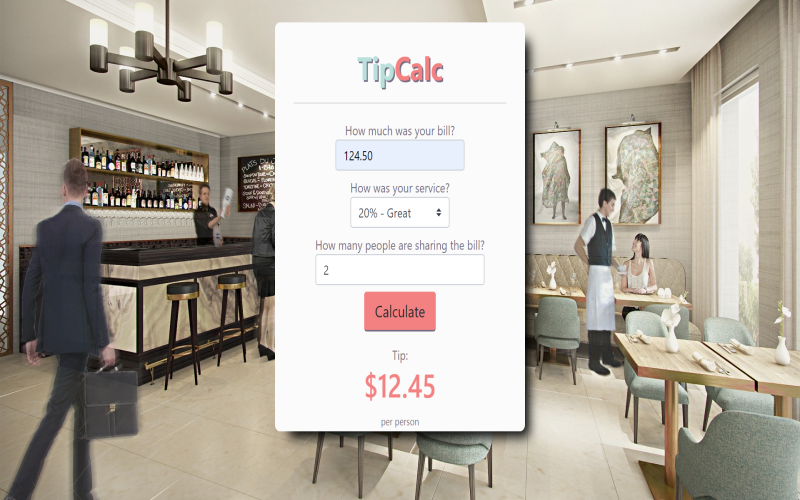

# Tip Calc
> Tip calculator tool.

The TipCalc calculator app is a modern application written in Node.js. The app provides standard calculations, as well as a set of customizable inputs to customize to your unique user experience.




## Features

* [X] User can enter a bill amount, choose a tip percentage, and see the tip returned in a per person format.
* [X] Percentage calculation functionality which offers options unique to user experience, as well as the ability to split bill amount amongst any party size given input data.
* [X] Visible input and bill amount output. 
* [X] Input memory capabilities.


## Installation and Dependencies

- Install the latest version of <a href="https://nodejs.org/en/">Node.js</a>
- Install <a href="https://docs.npmjs.com/downloading-and-installing-node-js-and-npm">NPM Dependencies</a> 
  - Download NPM package manager on the command line:
  
  ```sh
  npm install npm -g
  ```
  
  - Create a package JSON file:

  ```sh
  npm init
  ```
  
  - Install Express and body parser modules:
  
   ```sh
  npm i express body-parser 
  ```
    ### Why is this important?
    Express.js will be used for routing and body parser will allow you to parse your algorithm and return the necessary input data. Set     up should look something like this in your terminal:

    ```sh
    npm install express body-parser
    ```

- Integrate <a href="https://getbootstrap.com/">Bootstrap</a> for CSS framework
  - You can either install through the command line or simply copy/paste the readily available <a href="https://getbootstrap.com/docs/4.4/getting-started/introduction/">Boostrap CDN</a> into your HTML <head></head> (preferred for faster bandwith and decreased load time)
  
  
## Development

To develop the application you will need to first require the modules and construct an Express application inside your source code (i.e. app.js) -- 

This app relies heavily on Express and body parser for development. Here is a basic template of the server set up:

```javascript
// require modules and create Express application
var express = require('express');
var bodyParser = require('body-parser');
var app = express();

app.use(bodyParser.urlEncoded({extended:true}));

// application routing code goes here


// create a connection to your local server
app.listen(3000);
```

Check out the Express.js <a href="https://expressjs.com/en/guide/routing.html">routing references</a> for more info.


Be sure to run your app.js file using the terminal, I used Nodemon for development. 

Nodemon makes this process a lot easier by automatically restarting the node application when file changes in the directory are detected.

It would look like this:

```sh
nodemon app.js
```


From there you can launch locally on your server from http://locallhost.com/3000. 


## Technologies Used

* Express.js
* Bootstrap


## Contributing

Contributions are always welcome!
Please read the [contribution guidelines](contributing.md) first.

1. Fork it (<https://github.com/ewilliams12395/tip-calculator-app/fork>)
2. Create your feature branch (`git checkout -b feature/fooBar`)
3. Commit your changes (`git commit -m 'Add some fooBar'`)
4. Push to the branch (`git push origin feature/fooBar`)
5. Create a new Pull Request


<h2 style="font-weight: bold;">License</h2>
<p>This project is licensed under the MIT License - see the LICENSE.md file for details</p>

<h2 style="font-weight: bold;">Acknowledgments</h2>
<p>Design inspiration from <a href="https://dribbble.com/">Dribbble</a></p>
